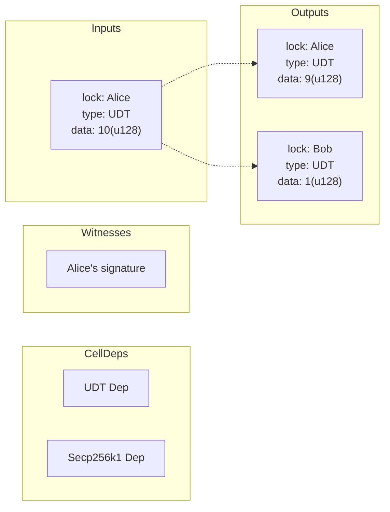

## Transaction Skeleton

Lumos provides an opinionated transaction structure called `TransactionSkeleton` from the `@ckb-lumos/helpers` module.
It simplifies assembling transactions on the client-side for CKB.

## At A Glance

The following code demonstrates how to build a transaction using `TransactionSkeleton`

```js
const indexer = new Indexer("https://ckb-rpc-entry")
const rpc = new RPC("https://ckb-rpc-entry")

// txSkeleton is immutable, use 'let' to declare and update
let txSkeleton = TransactionSkeleton({
  cellProvider: (query) =>
    // wrap the indexer as a CellProvider
    indexer.collector({ ...query, type: "empty" }),
})

// update TransactionSkeleton
txSkeleton = txSkeleton
  .update("inputs", (inputs) => inputs.push(inputs0, inputs1))
  .update("outputs", (outputs) => outputs.push(outputs0, outputs1))
  .update("cellDeps", (cellDeps) => cellDeps.push(lockScriptDep, typeScriptDep0))
  .update("witnesses", (witnesses) => witnesses.push(aliceSignature))

// pay fee by the fee rate
txSkeleton = await common.payFeeByFeeRate(txSkeleton, 1000, [fromAddr])

// sign the tranasction
const signatures = txSkeleton
  .get("signingEntries")
  .map(({ message }) => sign(message))
  .toArray()

// convert the TransactionSkeleton to RPC transaction
const signedTransaction = sealTransaction(txSkeleton, signatures)

// broadcast the transaction
const txHash = await rpc.sendTransaction(signedTransaction)
```

## Immutable.js

`TransactionSkeleton` utilizes [Immutable.js](https://immutable-js.com/) to provide an immutable data structure for transactions. This ensures data consistency and simplifies updates

## CKB Transaction

CKB, a UTxO-based blockchain inspired by Bitcoin,
verifies state transition on-chain instead of doing state transition on-chain.
As a result, developers must assemble transaction at client-side instead of calling actions(methods)
from a contract to trigger the transition.

The following illustration depicts transferring 1 UDT from Alice to Bob in a CKB transaction:



For a detailed explanation of CKB transaction structure, refer to [RFC-0022](https://github.com/nervosnetwork/rfcs/blob/master/rfcs/0022-transaction-structure/0022-transaction-structure.md).

## Usage Of `TransactionSkeleton`

`TransactionSkeletonType` extends the RPC transaction to simplify client-side transaction assembly.

```ts
type TransactionSkeletonType = {
  inputs: ImmutableList<Cell>
  outputs: ImmutableList<Cell>
  cellDeps: ImmutableList<CellDep>
  headerDeps: ImmutableList<Hash>
  witnesses: ImmutableList<HexString>
  inputSinces: ImmutableMap<number, PackedSince>

  // extended fileds
  cellProvider: CellProvider | null
  fixedEntries: ImmutableList<{ field: "inputs" | "outputs"; index: number }>
  signingEntries: ImmutableList<{
    // the "witness_args_lock" is used to work with WitnessArgs.lock in @ckb-lumos/common
    type: string
    index: number
    message: string
  }>
}
```

**Create a TransactionSkeleton**:

- Use `TransactionSkeleton()` to create an empty transaction
- Optionally, provide properties during creation:

```js
TransactionSkeleton({
  // restrict collector to lock-only cells
  cellProvider: (query) => indexer.collector({ ...query, type: "empty" }),
  inputs: [aStickyCellRequiredByMyDapp],
  cellDeps: [aStickyCellDep],
})
```

### `inputs` and `outputs`

Lumos uses a type `Cell` for both `inputs` and `outputs`, which differs from the CKB RPC definition

```ts
type Cell = {
  cellOutput: {
    lock: Script
    type?: Script
    capacity: HexNumber
  }
  data: HexString
  outPoint?: OutPoint
}
```

- `cellOutput`:
  - `lock`: Script representing the ownership of the cell.
  - `type`(optional): Script indicating the asset type (e.g., Spore, xUDT, sUDT).
  - `capacity`: Hex string representing the amount of shannon in the cell.
- `data`: Hex string representing the cell's state (e.g., UDT amount).
- `outPoint`(for input cells only): Identifies the cell's position in the blockchain

### `cellDeps` and `headerDeps`

These fields hold dependencies required by the scripts in `inputs` and `outputs`.

- `cellDeps`: Include script code for dependencies (e.g., lock script).
- `headerDeps`: Include block header dependencies (e.g., CKB DAO deposit block).

### `witnesses`

One-time state for the transaction, such as signatures or preimages of hashes in `data`.

### `signingEntries` and `fixedEntries`

- `signingEntries`: An extension for handling transaction signing
- `fixedEntries`: Cells that have been tagged with `fixedEntries`, including previous cells, will no longer participate in later calculations, such as `payFee` and `injectCapacity`, but will only use cells after the `fixedEntries`. The following example will only allow the `input4` and `input5` to be used as fee cells, and the `input0` to `input3` are fixed that won't be changed by `payFee` or `injectCapacity`

```yaml
outputs:
  - input0
  - input1 # marked by fixedEntries
  - input2
  - input3 # market by fixedEntries
  - input4
  - input5
```

### `cellProvider`

A `cellProvider: CellProvider` is a provider for the cells that required by some functions in `@ckb-lumos/common`,
such as `payFee`, `payFeeByFeeRate`, `transfer`, etc.

> [!NOTE]
> We can customize the `cellProvider` to avoid using unexpected cells in some s=scenarios like `payFee`, for example
>
> ```js
> txSkeleton = txSkeleton.update("cellProvider", (query) =>
>   indexer.collector({
>     type: "empty",
>     ...query,
>   })
> )
> ```
